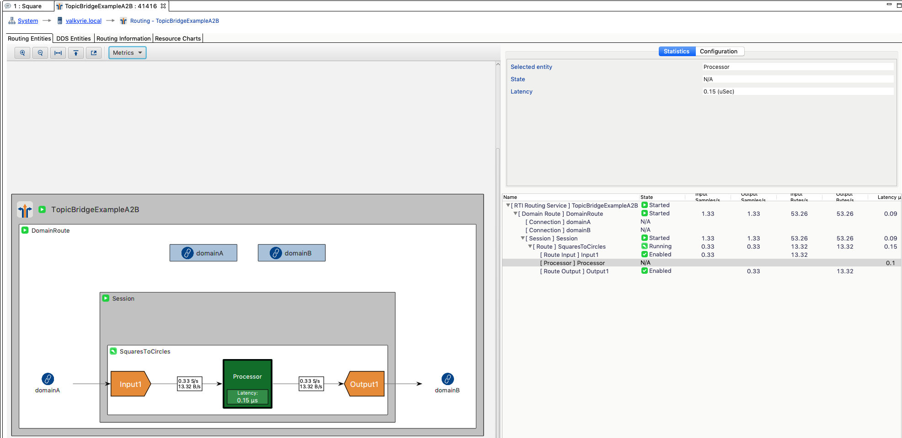

# Example Code: Routing Service Monitoring

## Concept

This example shows how to Configure the Monitoring Framework on *Routing Service*.

Monitoring refers to the distribution of health status information metrics from
instrumented RTI services.

RTI services provide monitoring information through a Distribution Topic, which
is a DDS Topic responsible for distributing information with certain characteristics
about the service resources. An RTI service provides monitoring information
through the following three distribution topics:

-   *ConfigDistributionTopic*: Distributes metrics related to the description and
configuration of a Resource. This information may be immutable or change rarely.
-   *EventDistributionTopic*: Distributes metrics related to Resource status
notifications of asynchronous nature. This information is provided asynchronously
when Resources change after the occurrence of an event.
-   *PeriodicDistributionTopic*: Distribute metrics related to periodic,
sampling-based updates of a Resource. Information is provided periodically at
a configurable publication period.

## Example Description

### Configuring RS

By default, monitoring is disabled in Routing Service. To enable monitoring you
can use the *\<monitoring>* tag or the *-remoteMonitoringDomainId* command-line
parameter, which enables remote monitoring and sets the domain ID for data publication.
See the RSConfig.xml file for more details.

When monitoring is enable, you can use Admin Console to see valuable monitoring
data in a visual way.



The configuration applied to Routing Service in the xml file to enable
the monitoring framework is the following:

``` xml
<routing_service name="TopicBridgeExampleA2B" group_name="GroupA">
    <monitoring>
        <!-- The domain used to publish the monitoring topics -->
        <domain_id>11</domain_id>
        <status_publication_period>
            <sec>6</sec>
            <nanosec>0</nanosec>
        </status_publication_period>
        <statistics_sampling_period>
            <sec>3</sec>
            <nanosec>0</nanosec>
        </statistics_sampling_period>
    </monitoring>

    ...
```

To make this example works, you can use ShapeDemo. Using the **RSConfig.xml** file,
Routing Service will route **Circles** from domain 0 to domain 1 as **Squares**.

### Monitoring subscriber

The example includes an application that subscribes to the monitoring topics.
This application shows changes in the Routing Service state by obtaining the
required information from the **ConfigDistributionTopic** and the **EventDistributionTopic**.

It also shows periodic information received from the **PeriodicDistributionTopic**.

See c++11/README.md file for more information about how to build and run it.

### Making all work together

This section describes the steps to test this example:

1.  Run Routing Service with the RSConfig file in a console:

```sh
rtiroutingservice -cfgFile RSConfig.xml -cfgName TopicBridgeExampleA2B
```

2.  Open *ShapesDemo* on domain 0 and publish a **Circle**
3.  Open another instance of *ShapesDemo* on domain 1 and subscribe to **Square**
2.  Open a console and build the application code as it shown in c++11/README.md.
3.  Cd the build folder
4.  Run the subscriber application on domain 11 in a console:

On *Windows* systems run:

```sh
RoutingServiceMonitoring_subscriber.exe 11
```

On *Linux* systems run:

```sh
./RoutingServiceMonitoring_subscriber 11
```

## References

- [Monitoring for Routing Service](https://community.rti.com/static/documentation/connext-dds/6.1.1/doc/manuals/connext_dds_professional/services/routing_service/monitoring.html)
- [Monitoring Distribution Platform](https://community.rti.com/static/documentation/connext-dds/6.1.1/doc/manuals/connext_dds_professional/services/routing_service/common/monitoring_dist.html)
